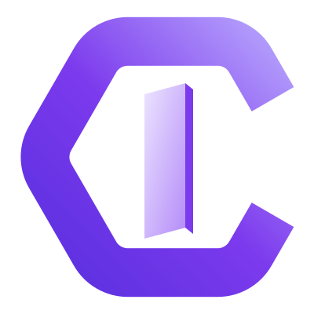

 

### We find what attackers find. Before they do.

Expert-led penetration testing across web, mobile, API, network and AI systems, accelerated by our own security agents and validated by human operators, so every finding is real.

 

---

## Who we are

CyInnove is an offensive security company. We test your applications, networks and infrastructure the way a real adversary would, then deliver findings your engineers can act on the same day.

Our approach is **semi-automated and human-validated**: internal AI agents accelerate reconnaissance and surface candidates, and expert operators reproduce and validate every finding. What reaches your report is real, backed by a **zero false positive** commitment.

## What we do

| Service | Focus |
|---|---|
| **Web Application Pentesting** | OWASP-aligned authentication, business logic, injection and access control |
| **Mobile Application Pentesting** | iOS and Android: binary protections, storage, transport and runtime |
| **Desktop Application Pentesting** | Memory, IPC, privilege escalation and update integrity |
| **API Pentesting** | REST, GraphQL and gRPC: BOLA and BFLA, data exposure, rate limits |
| **Network Pentesting** | Internal and external, lateral movement, Active Directory |
| **Secure Code Review** | Manual review for logic flaws, secrets and insecure patterns |
| **Third-Party Misconfigurations** | Cloud, SaaS and integration privilege and exposure audits |
| **Attack Surface Management** | Continuous discovery of subdomains, exposed services and leaks |
| **LLM Pentesting** | Prompt injection, tool abuse, data exfiltration and guardrail bypass |

## The CyInnove platform

Every engagement runs on our own platform, so you receive, manage and export everything from one place:

- **Findings management:** triage, assign, comment and request retests, with clear, mitigation-focused reports.
- **Attack surface:** a live inventory of your assets, with verification and continuous monitoring.
- **Engagement workflow:** the full lifecycle in one workspace per client.
- **Reports and exports:** branded reports plus CSV, JSON and PDF exports from a single center.
- **Integrations:** findings and status delivered straight to **Slack** or **Discord**.

## Why teams choose us

- **Human-validated AI testing.** Machines for speed, people for judgement. Zero false positives shipped.
- **Proprietary R&D tooling.** Internal AI agents and scanners built in-house, not reliant on public data.
- **Reports that get fixed.** Executive summary, reproduction steps and remediation guidance, not 200-page scanner exports.
- **Per-client workspaces.** Isolated, audited and built for enterprise access.

## Our team has helped secure

> **Google · Microsoft · Amazon · IBM · Alibaba · AT&T · Ford · Porsche · Vercel · Redis · Sentry · Shutterstock · RevenueCat · UiPath · Astro**

## Get in touch

- **General and assessments:** [hello@cyinnove.com](mailto:hello@cyinnove.com)
- **Support and partnerships:** [zomasec@proton.me](mailto:zomasec@proton.me)
- **LinkedIn:** [CyInnove](https://www.linkedin.com/company/cyinnove)

> Working on something sensitive? We operate under NDA and provide a responsible disclosure channel on request.

## Open source

We publish select tools and research for the community. Each repository carries its own license; see the `LICENSE` file in that repository.

---

 
© CyInnove | Cyber Innovation to Secure Assets and Applications

